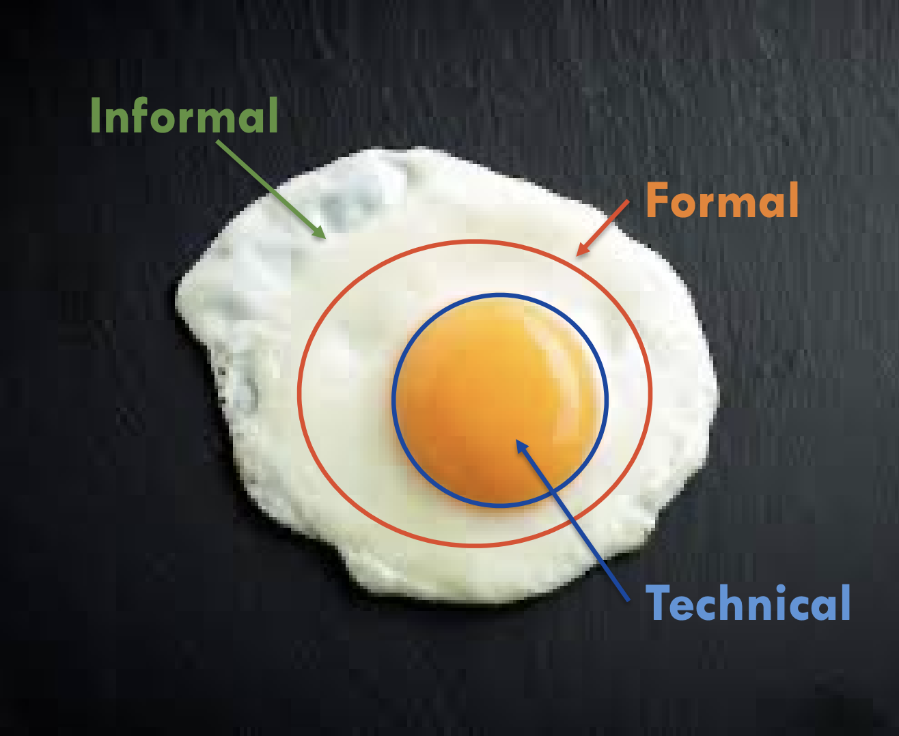

# Week1 Review

## Lecture

### 1 Orgnisation

> An organisation is a series of **information handling** activities
> Information handling is carried out at three levels– **technical**, **formal**, and **informal**

#### 1.1 Formal Systems

* Defines all major **‘official’** information handling of the organisation
* Rule based and tends to bring about uniformity
* Following the formal system is important
* Misinterpretation of the formal system can be detrimental
* Computerisation of major information flow to bring about efficiencies and effectiveness is possible
* Question: An org expands or shortens its hierarchy. What kind of control does it implement?
  * Formal Answer

#### 1.2 Technical Systems

* Technology enabled / automated parts of the formal system
* **Presupposes the existence of a formal system**
* Could be problematic if formal system DO NOT exist, or technical system is different to formal system
* Question: Which of the following is an example/scenario that technical control alone may not be effective?
  * It is easier to find what has been written on paper than in a database

#### 1.3 Informal Systems

* Represents organisation’s sub-culture where
  * meanings are established,
  * intentions are understood,
  * beliefs are formed,
  * commitments
  * responsibilities are made, altered and discharged
* A natural means to augment the formal systems
* Groups with overlapping memberships are possible as size of organisation grows
* Challenges of differences in opinions, goals, and objectives

#### 1.4 Coordination of 3 systems

* Technical system is bound by formal system of rules and regulations
* Technical system plays subservient role
* Beware of consequences of excessive bureaucratic red-tape of the formal systems and their relationship to the informal systems

### 2 Information Security Management

* Managing information Systems security is about **maintaining integrity of the three systems**
* Managing security is **the implementation of a range of controls**
* Control = “the use of interventions by a controller to promote a preferred behavior of a system being controlled”
  * Technical control, e.g., limit access to computer rooms
  * Formal control, e.g., organisational hierarchy
  * Informal control, e.g., information security awareness program

#### 2.1 Technical control

* Examples
  * Authentication and access control
  * Firewalls and De-Militarised Zones
  * Network segmentation
  * End-point security
  * Malicious content control
  * Automation
  * AI for detection and prediction
  * Implementation of technological solutions is dependent upon cost justifying the controls

#### 2.2 Formal control

* Examples
  * Support technological controls
  * Approach at organisational level
  * Implementing structured IS management
  * Giving strategic direction
  * Representation from a wide range of functional areas
  * Hiring and termination standards
  * Fair Practices and moral leadership
  * Protect management from claims of negligent duty
  * Compliance with the requirements of data protection legislation

#### 2.3 Informal control

* Examples
  * Security awareness is a cost effective control
  * Increased awareness should be supplemented with an ongoing education and training program
  * **Training and awareness** are extremely important in developing ‘trusted’ core of members of the firm
  * An environment of developing a common belief system

#### 2.4 Effectiveness of Technical Controls

* Technical controls alone are often not enough
* Consider constituting well thought baseline organisational controls

#### 2.5 Effectiveness of Technical & Formal Controls
<!-- todo -->
* Technical controls **alone** is not enough.
* In order to make technical controls well, it's necessary to consider constituting well thought baseline organisational controls.
* The fatal result of the unsecure technical control and formal control is hoorible: customer data breach which usually caused by the human error.

#### 2.6 Effectiveness of Technical & Formal & Informal Controls
<!-- todo -->
* Security awareness is a cost effective control.
* Increased awareness should be supplemented with an ongoing education and training program.
* As for firm, **Training and Awareness** are extremely important in developing trust.
* Provide the environment of developing a common belief system.

### 3 Institutionalising Information Security

* Organisational structure
* Policy and Procedural framework
* Linking access rights to the hierarchical level
* For efficiency and effectiveness purposes
* The reality is more complex than formal or the technical aspects of the system -- ethics and trust
* Maintaining consistency in communication
* Ensuring proper interpretation of information

## Tutorial

### Exercise 1

>The advent of internetworked organizations and the increased reliance of companies on the Internet to conduct their business has increased the chances of abuse.

#### My answer

True

1. More connectivity of companies and orgs via the Internet provides more oppotunites for hackers to access the sensitive information and do abuse.
2. An increased number of devices connected means a large variety of OS and software are being used and the more devices are used, the more vulnerabilities they may have which could be used by hackers.
3. Remote work and cloud based system will make it more difficult for maintaners to control or manage the IT infrastructures.

#### Sample answer

1. Organizations/companies with internet to conduct their business allows them to reach out more customers internationally; collaborate with other business and communicate with other suppliers.
2. Oragnizations enable outsiders to access their website, servers, user data etc.
3. Consequently, the system is more vulnerable to outside attacks like spyware, virus, social engineering etc.
4. The risk also comes from inside employees who have lower awareness of standard operation rules and other fomal rules.
5. With personal devices, the core data and vulnerable exploits are more likely to be attack through undefined safe devices.
6. Some people with no moral codes may sacrifice the benefit of companies.

### Exercise 2

> Do we really need to understand and place high importance on the informal controls prior to establishing security rules?
Yes, Why? / No, Why not?

#### My answer

True

1. The successful implementation of formal security rules depends on empoyees' enough understanding of the rules and grow habits. Otherwise, the rules are more likely to be ignored or violated. For example, in a company that I worked in, there was a Linux Desktop Workstation set a strong password based on security rules. However, the password is written on a small note sticked on the monitor now.
2. A set of security rules cannot be established without a great understanding of those informal controls. The manager need to know how to make emplyees accept and how they respond to it.

#### Team answer

Agree
Humans are often the weakest link in a security system. If we introduce rules to them without any awareness training or explanation, they are less likely to follow them, raising a security problem. Security rules are most effective when people understand the importance of following them. Informal controls help to improve this understanding.

#### Sample answer

Yes

* Establishing security rules require costly **effort** and **resources**. Informal controls need to deal with non-technical aspects of the information system including norm, culture of the organization, human behavior, employees’ and leaders’ mindset, and awareness. They are differencies from organizations to oragnizations.
* Moreover, **informal controls affect the effectiveness of both formal controls and technical controls.**
* As a result, in order to  build security rules and successfully implement them to protect the information system, we need to fully understand the risks from all aspects of informal system and place **high importance** on the informal controls.
* In addition, organizations also need to conduct ongoing education, training programs to educate employees and build their awareness/knowledge of the security rules and well accepted policies.

### Exercise 3
>
> Even though information system security goes way beyond the security of the technical edifice, applications and organization resources can only be protected by using the latest security gadgets.
Isn’t this a contradiction in itself?

#### My answer

True, it is a contradiction

1. I think the development of a thing will spiral rise, especially technologies. News vulnerabilities appear everyday and engineers handle them using new strategies or security gadgets. It is true the latest techniques will help when we want to protect systems and org resources. But I don't think they can only be protected by the latest gadgets. Some old-fationed rules and techniques are still effective. For example, the most effective way to prevent human error is to establish comprehensive rules and raise employees' awareness of IT security. In my opinion, the way to realise information security is not only depends on how new a tool is, but also on company's budget, the org's goals, and what threats they may meet in the future.

#### Team answer

* Formal control and informal control are even more important
* Many vuls cannot be solved by latest tools

#### Sample Answer
* **Conclusion**: It's a contradiction itself.
* Explain:
  * Technology controls alone cannot protect the information system.
  * Formal controls and informal controls are even more important which affect the effectiveness of technology controls.
  * Example on the human factor exposes risk the organization’s information system security.
  * Many vulnerabilities of information systems security cannot be solved by using latest technologies: need policies, security rules, regular education/training programs.

### Exercise 4
>
> Over engineering a solution or over bureaucratization of the formal systems have consequences for security and integrity of operations.
Comment?
Hints:
Over engineering a solution: technical solutions
Over bureaucratization: long process/complex procedure to make small things done, e.g. forms/documentations to be approved by government entities

#### My answer

True

1. Obviously, over engineering a solution make the whole system complicated and difficult to maintain.
2. Over bureaucratization, long process and complex procudure will affect the efficiency of system development. In addition, some officer in government entities are not familier with techniques, so their approving bahaviours are not so useful for security.

Complexity of the procudure
inefficiency

Human naturn: find an easiest way if things ara complex
Expose the information system to security threats
Example: login process requires lengthly password:
    But people write it down to

#### Sample answer

* **Comments**:
  * Complexity of the procedure/solution could lead to inefficiency.
  * For security rules, if people do not follow complex rules for their convenience, it could expose the information system to security threats.
  * Login process requires lengthy password. People tend to write it down to reuse.
