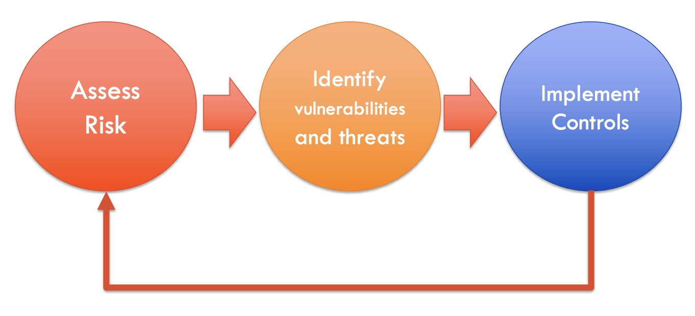
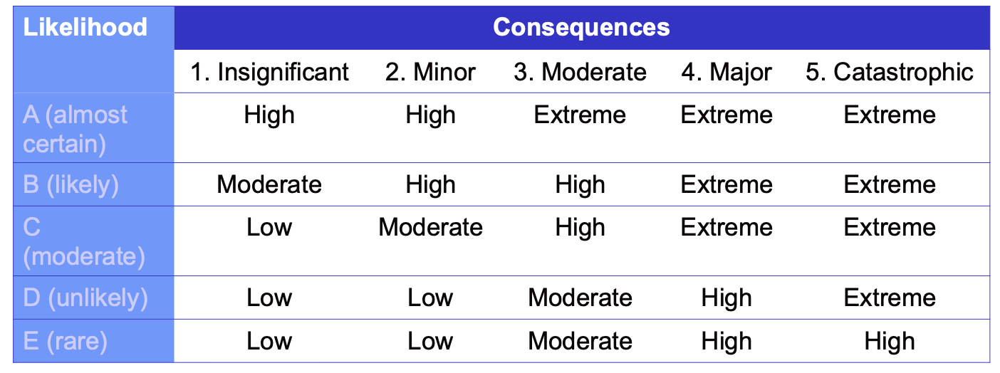

# Week2 Review

## Lecture

### 1 "Protection" - CIA Triad

1. **C**onfidentiality
2. **I**ntegrity
3. **A**vailability
4. Authentication
5. Non-repudiation

#### 1.1 Confidentiality

* Property of an information system whereby its information is disclosed only to authorized parties
* Protection of private data, where it resides or during its transmission
* Confidentiality of data has been compromised where inference may be drawn even without disclosure
  * e.g., (chatgpt)
  > Suppose a medical researcher is studying a group of patients who have a rare disease. The researcher has access to medical records and test results of the patients, but the patients' identities are kept confidential. However, if the researcher publishes certain statistics or findings about the disease, it may be possible for someone to infer the identities of the patients based on the information that was disclosed. This would compromise the confidentiality of the patients' data, even though their identities were not directly disclosed.
  >
  > In this case, the inference was made based on the information that was publicly disclosed, rather than on any direct disclosure of the patients' identities. However, the result is the same: the confidentiality of the data has been compromised.

* The “need-to-know” principle and the “need-to-withhold” principle
  * may work well in military environment, but in commercial env., the need to withhold principles may be more appropriate
  * When information is available to many, the “need-to-withhold” principle is more appropriate.

#### 1.2 Integrity

* An **unimpaired** condition of the data, a state of **completeness** and **wholeness** and **adherence** to a code of values
* All data is presented and accounted for, irrespective of it being accurate or correct
* A simpler definition: data has integrity when data and programs are changed only in a specified and authorised manner

#### 1.3 Availability

* Data and service are accessible when and where needed by legitimate users
* Relates to aspects of reliability
* Denial of service(DOS) is perhaps the best known example when availability of data is affected
* Availability attacks are mostly difficult to detect

#### 1.4 Authentication

* Assures that the message is from a source it claims to be
from
* A third party should not be able to **masquerade** as the sender or recipient of the data
* Timeliness is an important attribute of authentication
* Auditability is also of importance aspect of authentication

#### 1.5 Non-repudiation

* Example: (chatgpt)

> Suppose you are an online retailer and you sell a product to a customer who pays using their credit card. Non-repudiation means that the customer cannot later deny having made the payment, and you can prove that the payment was indeed made by that customer.
>
> To achieve non-repudiation in this case, you would use a digital signature to sign the transaction data. The customer would also sign the transaction data using their own digital signature. This creates a tamper-evident record of the transaction that can be used to prove that the payment was made by the customer and cannot be repudiated.
>
> If the customer later disputes the payment, you can use the digital signature record as evidence to show that the payment was made by them and that they cannot deny it. This provides a level of trust and accountability in the online transaction, and ensures that both parties can be held responsible for their actions.

### 2 Principle of Easiest Penetration

* A Chain is only as strong as its weakest link
* Analyse weakest points
* Strengthening one control/aspect might make another more attractive to a perpetrator

### 3 Vulnerabilities

* Definition:

> “Aweakness of an asset or group of assets that can be exploited by one or more threats” [ISO/IEC 13335-1:2004]

* Vulnerabilities exist in hardware, software and data
* ”A weakness in the computational logic (e.g., code) found in software and hardware components that, when exploited, results in a negative impact to confidentiality, integrity, or availability”
* The Common Vulnerability Scoring System (CVSS)
  * is an open framework for communicating the characteristics and severity of software vulnerabilities.
  * CVSS consists of three metric groups: **Base**, **Temporal**, and **Environmental**
    * The **Base** group represents the intrinsic qualities of a vulnerability
    * The **Temporal** group reflects the characteristics of a vulnerability that change over time
    * The **Environmental** group represents the characteristics of a vulnerability that are unique to a user's environment

* Type of Typical Vulnerabilities

|Computing Resource|Type of Typical Vulnerabilities|
| ----------- | ----------- |
|Hardware|Destruction; Interception; Interruption|
|Software|Modification; Interception; Interruption|
|Data|Destruction; Interception; Interruption; Fabrication; Modification; Disclosure|

* Types of Vulnerabilities
  * Modification
    * Hardware, Software, or Data is altered without authorisation
    * Altered software may perform additional computations
    * Changed hardware may modify data
    * Data can be modified in store or in transmission
  * Destruction
    * Hardware, Software, or Data is destroyed
    * Hardware may be destroyed by the environment
    * Data may be destroyed by deletion, or failure of hardware/software
  * Disclosure
    * Mostly about data
    * Make data available without due consent
    * Data is stolen (but owner may still have it)
    * Impact on security and privacy
    * Intentional or unintended
  * Interception
    * Unauthorised access to resources
    * Copying of programs, data, or other confidential information
    * An interceptor may use computing resources at one location to access assets elsewhere
  * Interruption
  * Fabrication
    * Spurious transactions are inserted into a network or records added to an existing database
    * Counterfeit objects placed in database by unauthorised parties
    * May be difficult to distinguish between genuine and forged one
    * Phishing

### 4 Threat

* Definition:

> “A set of circumstances that has **potential** to cause loss or harm”

* Vulnerabilities v/s Threats
* How to ensure secure goals?

### 5 Netflix Example

* Subscriber requests content from Netflix
  * Netflix direct the subscriber to nearby copy, retrieves content
  * may choose different copy if network path congested

### 6 Principles

#### 6.1 There is no such thing as absolute security

* Given enough time, tools, skills, and inclination, a hacker can break through any security measure

#### 6.2 The Three Security Goals Are Confidentiality, Integrity, and Availability

#### 6.3 Defense in Depth as Strategy

* Defense in depth
  * Involves implemented security in overlapping layers that provide the three elements needed to secure assets: prevention, detection, and response
  * The weaknesses of one security layer are offset by the strengths of two or more layers

#### 6.4 When left on their own, people tend to make worst security decisions

* Takes little to convince someone to give up their credentials in exchange for trivial or worthless goods
* Many people are easily convinced to double-click the attachment or links inside emails

#### 6.5 Computer security depends on two types of requirements: functional and assurance

* Functional requirements
  * Describe what a system should do
* Assurance requirements
  * Describe how functional requirements should be implemented and tested

#### 6.6 Security through obscurity is not an answer

* STO is based primarily onhiding important information and enforcing secrecy as the main security technique.
* Many people believe that if hackers don’t know how software is secured, security is better
  * Although this seems logical,it’s actually untrue

#### 6.7 Security = Risk Management

* Security is not concerned with eliminating all threats within a system or facility but with **addressing known threats and minimizing losses**
* **Risk analysis andr isk management are central themes** to securing information systems
* Risk assessment and risk analysis are concerned with **placing an economic value on assets to best determine appropriate countermeasures** that protect them from losses

#### 6.8 The Three Types of Security Controls Are Preventative, Detective, and Responsive

* A security mechanism serves a purpose by **preventing a compromise, detecting that a compromise or compromise attempt** is underway, or **responding to a compromise** while it is happening or after it has been discovered
* Example:

> Access to a bank’s safe or vault requires passing through layers of protection that might include human guards and locked doors with special access controls (**prevention**).
>
> In the room where the safe resides,closed-circuittelevisions,motion sensors, and alarm systems quickly detect any unusual activity (**detection**).
>
> The sound of an alarm could trigger the doors to automatically lock, the police to be notified, or the room to fill with tear gas (**response**).

#### 6.9 Complexity is the enemy of security

#### 6.10 Fear, Uncertainty, and Doubt (FUD) Do Not Work in Selling Security

* Information security managers must justify all investments in security using techniques of the trade
* When spending resources can be justified with good, solid business rationale, security requests are rarely denied

#### 6.11 People, Process, and Technology Are All Needed to Adequately Secure a System or Facility

* People, process and technology are all needed
* Formal, Informal and Technical controls are all needed

#### 6.12 Open Disclosure of Vulnerabilities Is Good for Security

## Tutorial

### Q1

Match the following terms with their meaning:

Terms:

1. Confidentiality
2. Data Integrity
3. System Integrity
4. Availability
5. Assurance

Meaning:

* A. Level of confidence that controls work
* B. System will work as intended
* C. Operation are accessible when needed
* D. Data can be trusted
* E. Data available to authorised users only

#### My Answer

* 1 -> E
* 2 -> D
* 3 -> B
* 4 -> C
* 5 -> A

### Q2

Which of the following terms is used to denote a potential cause of an unwanted incident, which may result in harm to a system or organization?

1. Vulnerability
2. Exploit
3. Threat
4. Attacker

#### My Answer

* 3

### Q3

Which group causes the most risk of fraud and computer compromises? Explain?

1. Employees
2. Hackers
3. Attackers
4. Contractors

#### My Answer

* 1 Employees
* Employees have
  * Authorized access to sensitive data
  * inside knowledge, such as the organization's security protocols

### Q4

To perform and review the risk analysis, the team members must come from different departments of the organizations. Which of the following is true? Explain why?

1. To make sure the process is fair and that no one is left out.
2. Because people in different departments understand the risks of their department. Thus, it ensures the data going into the analysis is as close to reality as possible.
3. Because the people in the different departments are the ones causing the risks, so they should be the ones held accountable.
4. It is not true. It should be a small group brought in from outside the organization because otherwise the analysis is biased and unusable.

#### My Answer

1. It is true, but not the main reason.
2. True and is the primary reason. Each department has their different risks, such as technical risks, financial risks which should be captured and evaluated comprehensively.
3. Not sure, seems meaningless and not a valid reason
4. I think external experts can be involved in performing the risk analysis, but not in the review process.

### Q5

Many types of threat agents can take advantage of several types of vulnerabilities. Match the following threat agents to vulnerabilities that they can exploit.
Threat Agents:

1. Malware
2. User
3. Employee
4. Attacker

Vulnerabilities:

* A. Mis-configured parameters in the operating system
* B. Lack of training or standards enforcement
* C. Lack of antivirus software
* D. Poorly written application. Lack of stringent firewall settings

#### My Answer

* 1 -> C
* 2 -> D
* 3 -> B
* 4 -> A

#### Sample Answer

* 1 -> C
* 2 -> A
* 3 -> B
* 4 -> D

### Q6

For Internet of Things (IoT), what other aspects of security besides CIA should be considered? Explain why?

#### My Answer

Authorization: IoT devices should be authorized to perform specific actions, to prevent unauthorized access to sensitive data

### Q7

Company A provides cloud computing services to their customers. To maintain the Confidentiality, Integrity and Availability, what practices that the company should leverage to maintain these measures?

#### My Answer

* confidentiality:
  * Encryption
  * Access control
* Integrity
  * Backup and recovery
* availability
  * Regular testing

### Q8

A server called Server1 is running Windows Server 2016. On Server1, a folder called Data is created and shared on the C drive. Within the Data folder, subfolders are created with each user’s name within the organization. Each person’s electronic paycheck is placed in each user’s folder. Later, you find out that John was able to go in and change some of the electronic paycheck amounts, while also deleting some of the electronic paychecks. Explain which one (or more) of the CIA components was not followed.

#### My Answer

* Confidentiality:
  * The data folder is shared and no access control, authorization or encrtyption was configured to protect sensitive data. Also, the folder is located in C drive where the Windows system drive is.
* Integrity
  * John can access, modify, and delete data without authorization. In addition, there is no backup system used to maintain integrity.

### Q9

In banking industry, a range of online services are now available to assist customers with business banking needs. Discuss the potential security risks of online banking services?

#### My Answer

1. Employees are not well trainned to use online services
2. The services via the internet may have vulnerabilities that could be used by attackers
