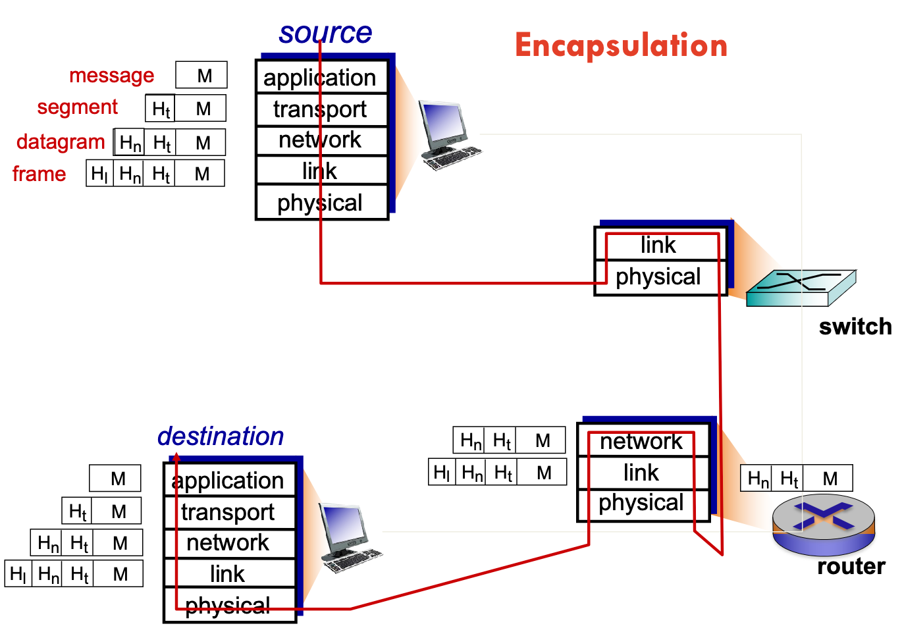
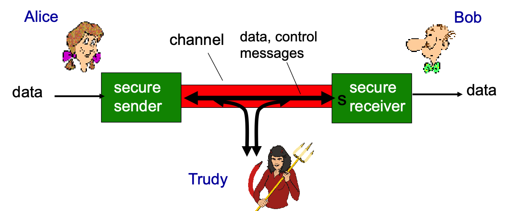
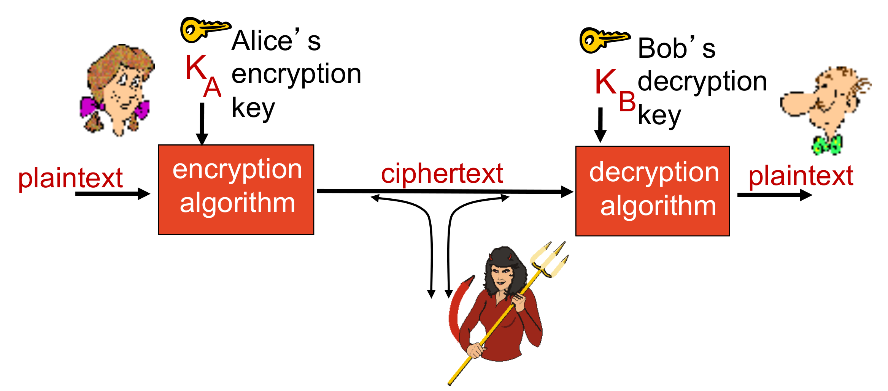
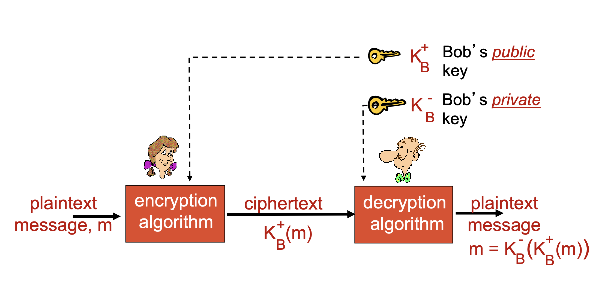
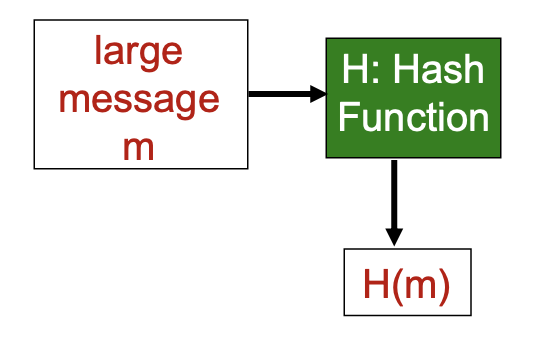
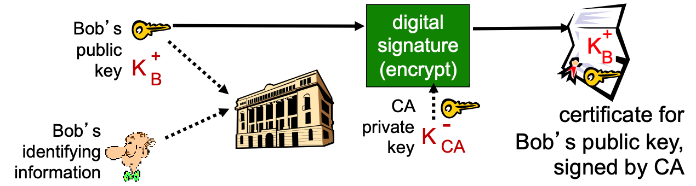

# Week3 Review

## Lecture - Introduction to Network Security and Cryptogrophy

### 1 What is “Internet” and how it works

* **Hosts** = **end system**
* running **network apps**
* communication links
  * fiber, copper, radio, satellite
  * transmission rate: **bandwidth**
  * **packet switches**: forward packets (chunks of data)
    * **routers** and **switches**
  * **protocols** control sending, receiving of messages
    * e.g., TCP, IP, HTTP, Skype, 802.11
  * Internet standards
    * RFC: Request for comments
    * IETF: Internet Engineering Task Force
  * infrastructure that provides services to applications:
    * Web, VoIP, email, games, e- commerce, social nets, ...
  * provides programming interface to apps
    * hooks that allow sending and receiving app programs to “connect” to Internet
    * provides service options, analogous to postal service

#### 1.1 Protocol

* human protocols:
  * “what’s the time?”
  * “I have a question”
  * introductions
* network protocols:
  * machines rather than humans
  * all communication activity in Internet governed by protocols

> **protocols** define **format**, **order** of **messages sent and received** among network entities, and **actions taken** on message transmission, receipt

#### 1.2 Protocol “layers”

* Why layering?
  * dealing with complex systems:
    * explicit structure allows identification, relationship of complex system’s pieces
  * modularization eases maintenance, updating of system
    * change of implementation of layer’s service transparent to rest of system
    * e.g., change in gate procedure doesn’t affect rest of system

#### 1.3 Internet protocol stack

* application
  * supporting network applications
  * FTP, SMTP, HTTP
* presentation*
  * allow applications to interpret meaning of data, e.g., encryption, compression, machine- specific conventions
* session*
  * synchronization, checkpointing, recovery of data exchange
* transport
  * process-process data transfer
  * TCP, UDP
* network
  * routing of datagrams from source to destination
  * IP, routing protocols
* link
  * data transfer between neighboring network elements
  * Ethernet, 802.111 (WiFi), PPP
* physical
  * bits “on the wire”

#### 1.4 Encapsulation

### 2 Network Security

* confidentiality
  * only sender, intended receiver should “understand” message contents
    * sender encrypts message
    * receiver decrypts message
* message integrity
  * sender, receiver want to ensure message not altered (in transit, or afterwards) without detection
* access and availability
  * services must be accessible and available to users
* authentication
  * sender, receiver want to confirm identity of each other

#### 2.1 Alice, Bob, Trudy

### 3 Vulnerabilities and threats in networking

* **eavesdrop**: intercept messages
* actively **insert** messages into connection
* **impersonation**: can fake (spoof) source address in packet (or any field in packet)
* **hijacking**: “take over” ongoing connection by removing sender or receiver, inserting himself in place
* **denial of service**: prevent service from being used by others (e.g., by overloading resources)

#### 3.1 DOS

* **Denial of Service (DoS)**: attackers make resources (server, bandwidth) unavailable to legitimate traffic by overwhelming resource with bogus traffic
  * 1. select target
  * 2. break into hosts around the network(botnet)
  * 3. send packets to target from compromised hosts

#### 3.2 Packet sniffing

* broadcast media (shared Ethernet, wireless)
* promiscuous network interface reads/records all packets (e.g., including passwords!) passing by
* wireshark software used for end-of-chapter labs is a (free) packet-sniffer

#### 3.3 IP spoofing

* send packet with false source address

#### 3.4 Others

* malware can get in host from:
  * **virus**: self-replicating infection by receiving/executing object (e.g., e-mail attachment)
  * **worm**: self-replicating infection by passively receiving object that gets itself executed
* spyware malware can record keystrokes, web sites visited, upload info to collection site
* infected host can be enrolled in botnet, used for spam. DDoS attacks

### 4 Network security controls

* Security policy: actions the entities of the system are allowed to take and which ones are prohibited

#### 4.1 Data Security Requirements

* **Security mechanisms**: to ensure the secure policy:
  * Physical and hardware controls
    * Locks and doors, guards at entry, general physical site planning
    * Security devices such as firewalls, IDS/IPS, etc.
    * Authentication hardware
    * Smart card applications and circuit boards controlling access to disk drives
  * Software Controls
    * Software development controls
    * Operating system controls
    * Controls within software programs
    * Controls needed at input, processing, and output levels
    * Balance between ease of use and level of security controls
    * **Encryption**
    * **Authentication**
    * **Authorization**
    * **Auditing**

### 5 Cryptography

#### 5.1 definition

> Conversion of messages from a comprehensible form into an incomprehensible one and back again at the other end, rendering it unreadable by interceptors or eavesdroppers without secret knowledge

* **Cryptography** uses the processes of **Encryption** and **Decryption**. The system it uses is called **Cryptosystem**
* Cryptosystem also uses **Encryption Algorithm** – which is a set of rules for encryption and decryption

#### 5.2 The language of cryptography

* **$m$** plaintext message - a comprehensible form
* **$K_A$** key – secret knowledge
* **$K_A(m)$** ciphertext, encrypted with key - an incomprehensible form
* **$m = K_B(K_A(m))$**
* Cryptography protects from **interruption**, **modification** and **fabrication**

#### 5.3 Symmetric key cryptography

* symmetric key crypto: Bob and Alice share same (symmetric) key: $K_s$
* requires sender, receiver know shared secret key

#### 5.4 Public Key Cryptography

* radically different approach [Diffie-Hellman76, RSA78]
* sender, receiver do not share secret key
* **public** encryption key known to all
* **private** decryption key known only to receiver

* **RSA**: Rivest, Shamir, Adelson algorithm

#### 5.5 Authentication

* Definition

> Authentication is the **process** whereby one party is **assured** (through acquisition of **corroborative evidence**) of **the identity of a second party** involved in a protocol, and that the **second has actually participated**.

* The elements needed to ascertain the identity:
  * Corroborative evidence
  * Process between (at least) two parties
  * Involvement and participation of the second party
* Corroborative evidence: factors that are unique to an entity
* Classic categorisation
  * Possession: Something the entity/user **has**
    * Physical key, phone to send SMS messages to
  * Inherence: Something the user **is**
    * Biometrics: fingerprints, iris scan, face and voice recognition
  * Knowledge: Something the user **knows**
    * Passwords, security questions (mother’s maiden name, etc.)

### 6 Authentication with Alice & Bob

<u>Goal: Bob wants Alice to “prove” her identity to him</u>

#### 6.1 Protocol ap 1.0

Alice says “I am Alice”

* Failure scenario: 
  * **Impersonation**: An attacker could impersonate Alice and claim to be her by saying "I am Alice". If the system only relies on this simple approach, the attacker could gain access to Alice's account or data.
  * **Replay attack**: An attacker could record Alice saying "I am Alice" and replay that recording later to gain access to the system.
  * **Man-in-the-middle attack**: An attacker could intercept the communication between Alice and the system and modify the message so that it appears to be from Alice. This type of attack could allow the attacker to gain access to the system.
  * **Eavesdropping**: If the communication between Alice and the system is not secure, an attacker could eavesdrop on the conversation and learn Alice's claim to be Alice. The attacker could then use that information to impersonate Alice and gain access to the system.

#### 6.2 Protocol ap 2.0

Alice says “I am Alice” in an IP packet containing her source IP address

* Failure scenario:
  * Trudy can create a packet “spoofing” Alice’s address: an attacker could spoof the source IP address in the packet to make it appear as if the packet came from Alice's IP address, even if it did not. The attacker could then send this packet to the system, claiming to be Alice.

#### 6.3 Protocol ap 3.0

Alice says “I am Alice” and sends her secret password to “prove” it.

* Failure scenario:
  * Playback attack: Trudy records Alice’s packet and later plays it back to Bob. If the secret password is not only valid for a single authentication attempt.

#### 6.4 Protocol ap 3.1

Alice says “I am Alice” and sends her **encrypted** secret password to “prove” it.

* Failure scenario:
  * record and playback still works if the encryption algorithm and key used for encrypting the password remain the same over time

#### 6.5 Protocol ap 4.0

* to prove Alice “live”, Bob sends Alice nonce, **R**. Alice must return **R**, encrypted with shared secret key
* nonce: number (R) used only **once-in-a-lifetime**

#### 6.6 Protocol ap 5.0

* use nonce, public key cryptography

* Bob computes $K^+_A(K^-_A(R)) = R$ and knows only Alice could have the private key, that encrypted R such that $K^+_A(K^-_A(R)) = R$

### 7 Digital signatures

> cryptographic technique analogous to hand-written signatures:

* Sender (Bob) digitally signs document, establishing he is document owner/creator.
* **Verifiable, nonforgeable**: recipient (Alice) can prove to someone that Bob, and no one else (including Alice), must have signed document
* Simple digital signature for message m:
  * Bob signs $m$ by encrypting with his private key $K^-_B$, creating “signed” message, $K^-_B(m)$

* Suppose Alice receives msg m, with signature: $m$, $K^-_B(m)$
* Alice verifies $m$ signed by Bob by applying Bob’s public key $K^+_B$ to $K^+_B(m)$ then checks $K^+_B(K^-_B(m)) = m$.
* If $K^+_B(K^-_B(m)) = m$, whoever signed m must have used Bob’s private key.
* Alice thus verifies that:
  * Bob signed $m$
  * no one else signed $m$
  * Bob signed $m$ and not $m`$
* non-repudiation:
  * Alice can take m, and signature $K^-_B(m)$ to court and prove that Bob signed $m$

#### 7.1 Message digests

* computationally expensive to public-key-encrypt long messages
* goal: fixed-length, easy-to-compute digital “fingerprint”
  * apply hash function $H$ to $m$, get fixed size message digest, $H(m)$.
* Hash function properties:
  * many-to-1
  * produces fixed-size msg digest (fingerprint)
  * given message digest $x$, computationally infeasible to find m such that $x = H(m)$

#### 7.2 Digital signature = signed message digest

* Bob sends digitally signed message

* Alice verifies signature, integrity of digitally signed message

#### 7.3 Certification authorities

* certification authority (CA): binds public key to particular entity, E.
* E (person, router) registers its public key with CA.
  * E provides “proof of identity” to CA.
  * CA creates certificate binding E to its public key.
  * certificate containing E’s public key digitally signed by CA – CA says “this is E’s public key”

* When Alice wants Bob's public key:
  * get Bob's certificate
  * apply CA's public key to Bob's certificate, get Bob's public key

### 8 Intrusion detection systems

* packet filtering
  * operating on TCP/IP headers only
  * no correlation check among sessions
* IDS: intrusion detection system
  * deep packet inspection: look at packet contents (e.g., check character strings in packet against database of known virus, attack strings)
  * examine correlation among multiple packets
    * port scanning
    * network mapping
    * DoS attack
* Signature-based systems or Anomaly-based systems

### 9 Vulnerabilities in Networks

* Anonymity
* Multiplicity of points of attack
* Resource sharing
* Complexity of system
* Uncertain perimeter
* Unknown path
* Protocol flaws / protocol implementation flaws

### 10 Network Security Controls

#### 10.1 Vulnerability and Threat assessment

* Network Architecture
  * Network segmentation
  * Architect for availability
  * Avoid SPOF (single points of failure)
  * Encryption
    * Link encryption
    * End-to-end encryption
    * Secure Virtual Private Networks
    * Public Key Infrastructure and Certificates
    * SSL and SSH

#### 10.2 Design and implementation

* Strong Authentication
  * One Time Password
  * Challenge Response authentication
  * Kerberos
* ACLs (Access Control Lists)
* Firewalls
  * Packet Filters
  * Stateful Packet Filters
  * Applicationp roxies
  * Diodes
  * Firewall on end-points
* Intrusion Detection / Prevention Systems
  * Networkbased/hostbased
  * Signature based
  * Heuristics based/protocol anomaly based
  * Stealth mode
* Data-Leakage Protection systems
  * Network based / host based
* Content scanning/Anti-Virus/Spyware Control systems
  * Network based / host based
* Secure e-mail Systems
* Policies and Procedures
  * Enterprise-wide Information Security Policy – Motherhood statements
  * Procedures – Detailed workflows
  * Buy-in (from executives and employees)
  * Review, enhancement and modification
