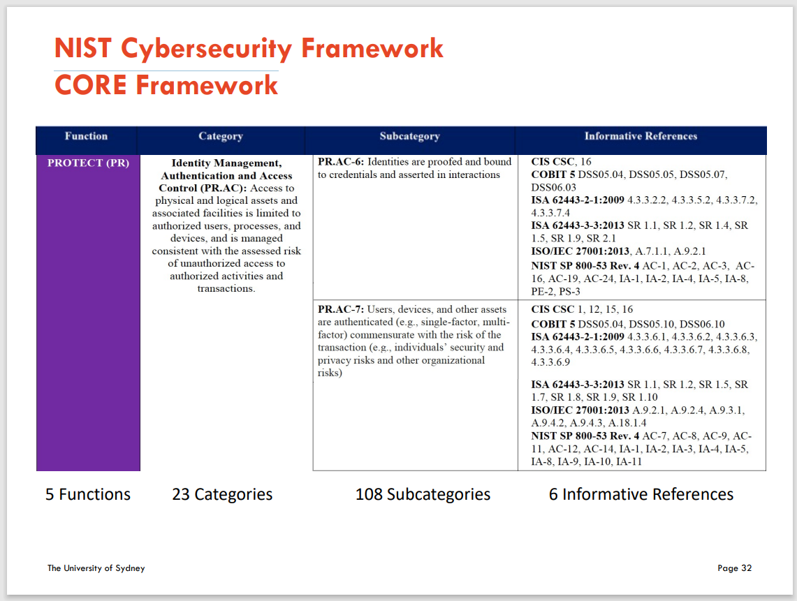
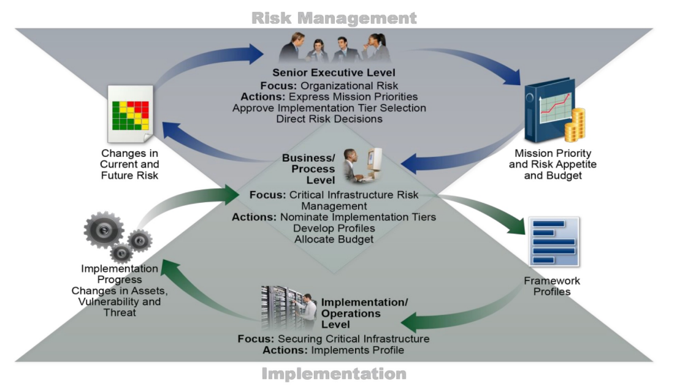
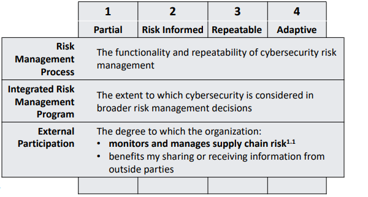

# Week 5 Formal Methods for Information Systems Security

### Ten Deadly Sins of IS Security Management

1. Not realizing that information security is a corporate governance responsibility (the buck stops right at the top).
2. Not realizing that information security is a business issue and not a technical issue.
3. Not realizing the fact that information security governance is a multi-dimensional discipline (information security governance is a complex issue, and there is no silver bullet or single 'off the shelf' solution).
4.Not realizing that an information security plan must be based
on identified risks - Addressing known threats and minimizing losses.
4. Not realizing (and leveraging) the important role of international best practices for information security management.
5. Not realizing (and leveraging) the important role of international best practices for information security management.
6. Not realizing that a corporate information security policy is absolutely essential.
7. Not realizing that information security compliance enforcement and monitoring is absolutely essential.
8. Not realizing the core importance of information security awareness amongst users.
9. Not realizing that a proper information security governance structure (organization) is absolutely essential.
10. Not empowering information security managers with the infrastructure, tools and supporting mechanisms to properly perform their responsibilities - All these going to cost time, effort and money.

### Formal IS Security

- Creating -organisational structures- and processes to ensure information security, i.e. ensure confidentially, integrity, and availability. (Organizations are entities that process infomation with division of labour and add value in the process.)
- Creating and sustaining proper responsibility structures.
- Maintaining -integrity of the roles-.
- Creating adequate -business process-.
- Establishing an overarching information security strategy and policy.

### Four Classes of Formal IS Security

1. Responsibility and authority structures.
2. Security strategy and policy.
3. Business processes.
4. Roles and skills.

Dimensions:

- Organisational buy-in
- Security policy

### Explanation

1. Resoponsibility and Authority Structures

- Determines the performance of the formal control systems
- Provide a means to identify responsible agents
- Understand the underlying patterns of behavior
- Manifest the roles and reporting structures of organisational members.
- Separation of authority and responsibilities
  - E.g. Clark-Wilson Model
  - This ensures that a critical task cannot be carried out by one entity.

2. Security Strategy and Policy

- Determine how administrative aspects of IS security are
managed.
- Establish a security program.
- Assign program management responsibilities.
- Set an organisation-wide computer security purpose and
objectives.
- Establish a basis for policy compliance.

3. Business Process

- Define and identify information flows.
- Establish operational integrity.
- Enable alignment with responsibility and authority structures.
- Enable identification of areas of communication gaps.

4. Roles and Skills

- Identify roles required to match responsibility and authority
structures.
- Identify skill levels required to match the roles.
- Identify mechanisms to attract, train and retain required skills.

### Organisational Buy-in

- Support from an organisation’s executive leadership is
the most challenging task.
- A two-fold need for executive leadership buy-in
  - Assures staff buy-in
  - Ensures funding
- Support from the IT Department is also essential.
- Every employee support is also an important
ingredient.
  - It's also a challenge to educate the employee.

### The Ten Aspects of Importance in Bridging the Gap Between the Management and Technicians

1. Getting top management's backing (the CEO buying into the idea first).
2. Getting technical management backing (technical departments are the custodians of ICT in an organisation).
3. Address the ICT security problem as a special project (forming a provisional ICT security task force).
4. Quick scan of the ICT-related risks and their consequences for the organisation (risk exposure due to ICT).
5. Getting management's attention and backing.
6. Getting the current status of ICT security documented (take stock of the existing situation).
7. Conduct awareness-raising sessions among users (with some feedback from steps 1-6).
8. Carry out risk assessment and analysis.
9. Work out the mitigation plan (short-term plan for issues that need immediate attention and long-term mitigation plan).
10. Develop countermeasures.

### Information Security Policy

- Program-level Policies
  - Institutionalises the IS program.
  - Establishes purpose and objectives of the program.
  - Defines structure of the program.
  - Defines roles and responsibilities in the structure.
  - Defines scope of the program.

- Program-framework Policies - How?
  - Support implementation of program.
  - Sets the contexts for IT decisions to be made.
  - Defines practices, standards & guidelines.
  - Defines framework for major IS security initiatives (such as business.
  - continuity, Data Centre security, Application development, etc.).

- Issue-specific & System-specific Policies
  - Address specific areas of concerns.
  - Compliance policies.
  - Technical infrastructure baselines
- Numerous IS security problems have been attributed
to the lack of a security policy.
- Possible vulnerabilities related to security policies
occurs at three levels
  - policy development
  - policy implementation
  - policy reinterpretation

### Formulation of a Good Security Policy

- An organisation incorporates the strategic direction of the
company both at a micro and macro levels
- Clarification of the strategic agenda sets the stage for
developing the security model
- The security policies determine the processes and techniques
required to provide the security but not the technology
- The implementation of security policies entails the development of procedures to implement the techniques defined in the security policies
- Security processes and techniques should be monitored
constantly
- A response policy is an integral part of a good security policy
- Establish procedures and practices for educating all
stakeholders

### NIST Cybersecurity Framework Three Primary Components

#### Core

Desired cybersecurity outcomes organized in a hierarchy and aligned to more detailed guidance and controls.

#### Profiles

Alignment of an organization’s requirements and objectives, risk appetite and resources using the desired outcomes of the Framework Core.

#### Implementation Tiers

A qualitative measure of organizational cybersecurity risk management practices.

### NIST Cybersecurity FrameworkCORE Framework

- **Identify** - Develop an organizational understanding to manage cybersecurity risk to systems, people, assets, data, and capabilities.

- **Protect** - Develop and implement appropriate safeguards to ensure delivery of critical services.

- **Detect** - Develop and implement appropriate activities to identify the occurrence of a cybersecurity event.

- **Respond** - Develop and implement appropriate activities to take action regarding a detected cybersecurity incident.

- **Recover** - Develop and implement appropriate activities to maintain plans for resilience and to restore any capabilities or services that were impaired due to a cybersecurity incident.

### NIST Cybersecurity Framework CORE Framework

### NIST Cybersecurity Framework Framework Profile

- The Framework Profile (“Profile”) is the alignment of the
Functions, Categories, and Subcategories with the business
requirements, risk tolerance, and resources of the organization.
- Organizations may choose to have multiple profiles.

### NIST Cybersecurity Framework Implementation Tiers

- The Framework Implementation Tiers (“Tiers”) provide context
on how an organization views cybersecurity risk and the
processes in place to manage that risk.
- Ranging from Partial (Tier 1) to Adaptive (Tier 4), Tiers
describe an increasing degree of rigor and sophistication.

### NIST’s Seven Steps process for an Effective Security Program

- Step 1: Prioritize and Scope.
  - Identify Program Scope, Goals, and Objectives
- Step 2: Orient.
  - Identifies related systems and assets, regulatory requirements, and overall risk approach.
  - Consults sources to identify threats and vulnerabilities applicable to those systems and assets.
- Step 3: Create a Current Profile.
  - Develops a Current Profile by indicating which Category and
Subcategory outcomes from the Framework Core
- Step 4: Conduct a Risk Assessment.
  - Analyzes the operational environment in order to discern the likelihood of a cybersecurity event and the impact
- Step 5: Create a Target Profile.
  - Creates a Target Profile that focuses on the assessment of the FrameworkCategories and Subcategories describing the organization’s desired cybersecurity outcomes.
- Step 6: Determine, Analyze, and Prioritize Gaps.
  - Compares the Current Profile and the Target Profile to determine gaps
  - Creates a prioritized action plan to address gaps - reflecting mission drivers, costs and benefits, and risks
- Step 7: Implement Action Plan.
  - Determines which actions to take to address the gaps, if any, identified in the previous step
  - Adjusts its current cybersecurity practices in order to achieve the Target Profile.